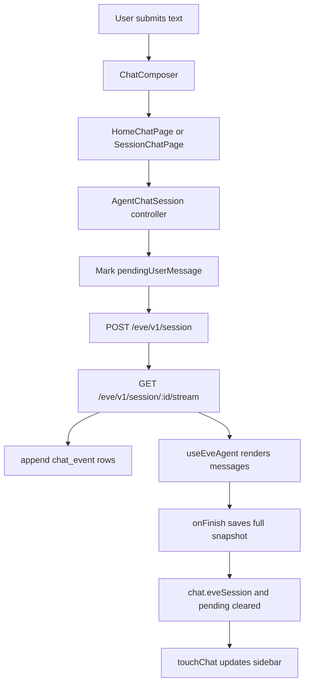

# How the Chatbot Works

This document explains the eve chat template end to end. It is written for
future maintainers who need to understand why the app is shaped this way, where
state lives, how messages stream, and how to safely change the chat experience.

The short version: this is not a generic stateless chat UI. The browser talks to
an eve agent through same-origin `/eve/v1/*` routes, persists eve stream events
to Postgres as they arrive, keeps an eve session cursor so interrupted streams
can resume, and uses a static Next.js shell so the sidebar and composer do not
thrash during route navigation.

## Main Pieces

The template has four major layers:

1. The eve agent layer in `agent/`
2. The Next.js shell and page layer in `app/`
3. The chat UI components in `components/chat/`
4. The persistence, auth, setup, and rate-limit layer in `lib/`

Important files:

| File | Purpose |
| --- | --- |
| `agent/agent.ts` | Defines the eve agent and model. |
| `agent/channels/eve.ts` | Configures the eve web channel and auth adapters. |
| `agent/channels/slack.ts` | Configures the Slack channel route and Vercel Connect credentials. |
| `agent/connections/notion.ts` | Defines the Notion MCP connection through Vercel Connect. |
| `agent/connections/linear.ts` | Defines the Linear MCP connection through Vercel Connect. |
| `agent/connections/sentry.ts` | Defines the Sentry MCP connection through Vercel Connect. |
| `next.config.ts` | Wraps the app with `withEve(nextConfig)`, which mounts the `/eve/v1/*` routes. |
| `app/(chat)/layout.tsx` | Renders the static chat shell immediately, then streams viewer/setup/sidebar data through Suspense. |
| `app/(chat)/page.tsx` | Root chat screen. Creates a new chat row and navigates into `/chat/[id]`. |
| `app/(chat)/chat/[id]/page.tsx` | Session route. Streams the active chat data into the client shell. |
| `app/_components/agent-chat-shell.tsx` | Client shell for sidebar state, history pagination, auth modal, and shared chat context. |
| `app/_components/home-chat-page.tsx` | Root-page composer and logo experience. |
| `app/_components/session-chat-page.tsx` | Session-page composer, active chat sync, and controller wiring. |
| `app/_components/agent-chat.tsx` | The eve client bridge: sending, streaming, persistence, resume, pending auth, and display state. |
| `components/chat/composer.tsx` | The controlled chat input. |
| `components/chat/message.tsx` | Renders eve messages, markdown, reasoning, tools, and input requests. |
| `components/chat/sidebar.tsx` | Paginated chat history sidebar. |
| `components/chat/integrations-menu.tsx` | Per-turn connection toggle UI. |
| `app/actions/chat.ts` | Server actions for chat creation, persistence, pending state, skip auth, and rate checks. |
| `app/api/chats/route.ts` | Paginated chat history endpoint. |
| `lib/db/schema.ts` | Drizzle tables for Better Auth, chats, and chat events. |
| `lib/db/queries.ts` | Chat list, chat load, event save, snapshot save, and delete queries. |
| `lib/setup.ts` | Setup readiness checks for Neon, migrations, auth, and Redis. |
| `lib/auth.ts` | Better Auth configuration with Sign in with Vercel. |
| `lib/eve-auth.ts` | Converts a Better Auth viewer into an eve channel principal. |
| `lib/rate-limit.ts` | Upstash Redis based fixed-window rate limiting. |

## Runtime Model

There are two related but separate concepts:

1. A **local app chat**, represented by a row in the `chat` table.
2. An **eve session**, represented by eve's `SessionState` and remote session
   stream.

The app chat gives the user a stable URL such as `/chat/abc`, a sidebar title,
and persisted event history. The eve session is the durable conversation state
that eve uses to continue, wait for authorization, resume streams, and accept
follow-up input.

The app stores eve session state on the chat row:

```ts
chat.eveSession: SessionState | null
```

The app stores eve stream events in ordered rows:

```ts
chat_event.eventIndex: number
chat_event.event: HandleMessageStreamEvent
```

Those two pieces are intentionally separate. The `eveSession.streamIndex` tells
eve where to resume from in the remote session stream. The local
`chat_event.eventIndex` tells Postgres how to order the event log for rendering.
Do not treat those indices as interchangeable.

## Rendering Strategy

The app uses Next.js App Router with Cache Components enabled. The chat shell is
designed to render immediately, while dynamic data streams in behind hidden
Suspense boundaries.

### Shell First

`app/(chat)/layout.tsx` renders this immediately:

```tsx
<AgentChatShell
  initialChats={[]}
  initialNextCursor={null}
  setupStatus={getInitialSetupStatus()}
  viewer={null}
>
  {children}
  <Suspense fallback={null}>
    <ResolvedChatBootstrap />
  </Suspense>
</AgentChatShell>
```

The shell can paint the sidebar frame, top-right auth buttons, and route body
without waiting for the database or auth session. Then `ResolvedChatBootstrap`
fetches:

- setup readiness from `getSetupStatus()`
- the Better Auth viewer from `getServerViewer(setupStatus)`
- the first page of chat history from `listChatsPageByUser(viewer.id)`

It passes that data through `AgentChatBootstrapSync`, which dispatches a browser
event. `AgentChatShell` listens for that event and merges the real viewer,
setup status, and sidebar history into client state.

This pattern avoids a blocking route, which would delay the entire page.

### Session Route Data

`app/(chat)/chat/[id]/page.tsx` uses the same idea. It renders the session page
shell first:

```tsx
<SessionChatPage chatId={chatId}>
  <Suspense fallback={null}>
    <ExistingChat chatId={chatId} />
  </Suspense>
</SessionChatPage>
```

`ExistingChat` loads the active chat from Postgres and emits it through
`AgentChatRouteSync`. `SessionChatPage` listens for that sync event and then
passes the loaded `ActiveChat` into `AgentChatSession`.

This is why the top bar, sidebar, and composer can stay stable while the chat
body itself waits for data.

## Sidebar State And Pagination

The sidebar is owned by `AgentChatShell`.

State it owns:

- desktop sidebar open or closed
- mobile sidebar drawer open or closed
- current history page
- next cursor
- active chat id
- viewer
- setup status
- auth modal state
- enabled connection toggles

The desktop open/closed state is persisted in a cookie:

```ts
SIDEBAR_COOKIE_NAME = "eve-chat-sidebar"
```

`SidebarCookieScript` writes an early document hint before React hydrates. That
prevents the sidebar from opening for a frame and then collapsing.

Chat history is paginated. The first page is loaded by `ResolvedChatBootstrap`.
More pages are loaded from:

```txt
GET /api/chats?cursor=<cursor>
```

`listChatsPageByUser` orders by `updatedAt desc, id desc` and fetches
`CHAT_HISTORY_PAGE_SIZE + 1`, where the page size is currently 20. The extra
row determines whether there is a next cursor.

The cursor is encoded as:

```txt
<updatedAt ISO string>::<chat id>
```

The sidebar uses an intersection observer sentinel at the bottom of the list.
When it becomes visible, `AgentChatShell.loadMoreChats()` fetches the next page
and appends only chats that are not already present.

Creating, sending to, or deleting a chat updates the sidebar optimistically
through:

- `touchChat(chat)`
- `removeChat(chatId)`
- `updateChatTitle(chatId, title)`

## Root Page Flow

The root route is `app/(chat)/page.tsx`, rendered by `HomeChatPage`.

The root page is the "start a new chat" experience. It has:

- the eve logo
- a centered composer
- footer links
- the shared sidebar and top auth controls from `AgentChatShell`

When the user submits the first message:

1. The input is trimmed.
2. If setup is incomplete, an error toast explains what is missing.
3. If the user is not signed in, `requestSignIn(message)` opens the auth modal
   and saves the draft in `sessionStorage`.
4. If the user is signed in, `createChatAction({ pendingUserMessage: message })`
   creates a chat row.
5. The chat title is derived from the first user message with
   `createFallbackTitle`.
6. The new chat is inserted into the sidebar with `touchChat(created)`.
7. The app navigates to `/chat/<id>`.

The root page does not call eve directly. It creates the app chat first and
lets the session route consume the pending message once the eve client is ready.

That matters because a chat URL should exist before the first response starts
streaming.

## Session Page Flow

The session route is rendered by `SessionChatPage`.

`SessionChatPage` owns:

- the loaded `ActiveChat`
- the controlled composer draft
- a ref to the `AgentChatController`
- loading/error UI for the route
- the pending user message loaded from the database

The `AgentChatController` is provided by `AgentChatSession`:

```ts
type AgentChatController = {
  reset: () => void;
  sendMessage: (text: string, draftHandlers: DraftHandlers) => Promise<void>;
  stop: () => void;
};
```

The session composer calls `controller.sendMessage(text, handlers)`.

If the route loaded a `pendingUserMessage`, `SessionChatPage` auto-consumes it
once:

- the chat has loaded
- the controller exists
- the controller is not busy
- the controller is not disabled by setup or pending authorization

This is how the first message from the root page actually gets sent to eve after
navigation.

## eve Client Bridge

Most of the chat logic lives in `app/_components/agent-chat.tsx`.

The core hook is:

```tsx
const agent = useEveAgent({
  initialEvents: activeChat?.events ?? [],
  session: persistedSessionRef.current,
  onEvent: persistStreamEvent,
  onFinish: (snapshot) => {
    void persistSnapshot(snapshot);
  },
});
```

`useEveAgent` handles reducing eve stream events into renderable chat messages.
The template wraps it with persistence and resume logic.

### Persisted Client Session

The browser session object is created by `createPersistedClientSession`.

It exposes:

- `send(input)`
- `stream(options)`
- `applyLocalEvents(events)`
- `setState(nextSession)`
- `state`

When `send(input)` is called:

1. It normalizes the input.
2. It posts to `/eve/v1/session` for a new eve session, or
   `/eve/v1/session/:sessionId` for a continuation.
3. It reads the `x-eve-session-id` response header.
4. It updates the local `SessionState`.
5. It saves that session state to the chat row.
6. It returns a browser-compatible message response whose async iterator reads
   `/eve/v1/session/:sessionId/stream`.

The app never talks directly to a third-party model endpoint. It talks to eve's
same-origin session API, which is mounted by `withEve(nextConfig)`.

### Streaming

The stream reader is `streamSessionEvents`.

It opens:

```txt
GET /eve/v1/session/:sessionId/stream?startIndex=<n>
```

Then it reads newline-delimited JSON events.

For every event:

1. Push it into the current stream buffer.
2. Increment the next remote stream index.
3. Yield it to `useEveAgent`.
4. Stop if the event settles the turn.

A turn is considered settled when `lib/chat/events.ts` sees one of:

```ts
authorization.required
session.completed
session.failed
session.waiting
```

The stream reader retries a few times for transient stream-open failures:

- 404
- 409
- 425
- 500
- 502
- 503
- 504

It also tolerates stream disconnects by reconnecting from the next unread stream
index.

When the async iterator exits, it calls `onFinalize(events)`, which advances the
browser session state using the events that were actually observed.

## Sending A Message

Follow-up messages are sent by `AgentChatSession.sendMessage`.

The intended order is:

1. Ignore empty input.
2. Ignore if the session is already busy.
3. If eve is waiting on connection authorization, do not send regular user
   text. Show a helpful error instead.
4. Render an optimistic user bubble immediately when possible.
5. Run `prepareSend(message)`.
6. Mark the chat row with `pendingUserMessage`.
7. Call `agent.send({ message, clientContext })`.
8. Let `useEveAgent`, `onEvent`, and `onFinish` handle streaming and
   persistence.

`prepareSend` does the things that must happen before talking to eve:

- verify setup is ready
- request sign-in if there is no viewer
- check Redis rate limits
- create a chat row if one does not exist yet
- navigate to the new chat URL when necessary

The optimistic user bubble is separate from persisted eve events. It is created
with `createPendingUserMessage`. Once the real eve message appears in the
reduced message list, `hasLatestUserMessage` clears the local pending bubble.

This keeps the UI feeling immediate while still letting eve produce the
canonical event log.

## Persistence Model

The app persists at two moments:

1. As each stream event arrives
2. When the final snapshot is available

### Event-By-Event Persistence

`persistStreamEvent(event)` writes each event through:

```ts
appendChatEventAction({
  chatId,
  event,
  eventIndex,
});
```

`eventIndex` is a local monotonic counter for the current chat. The database has
a unique index on `(chatId, eventIndex)`, and writes use conflict updates so
retrying a write can replace the same slot.

This event-by-event persistence is what makes refresh/resume possible even if
the browser closes mid-turn.

### Snapshot Persistence

When `useEveAgent` finishes a turn, it calls `onFinish(snapshot)`.

The snapshot includes:

- the full reduced event list known by eve React
- the current eve `SessionState`

The template calls `saveChatSnapshotAction({ chatId, events, session })`.

`saveChatSnapshot` upserts each event by index, deletes any events past the new
snapshot length, saves the eve session state, clears `pendingUserMessage`, and
updates the chat timestamp.

### Why Snapshot Merging Exists

There are local events that may not come from the remote stream, especially
locally synthesized authorization skip events. There are also cases where the
snapshot returned by the hook starts after some initial events that the app
already loaded from Postgres.

To avoid losing or duplicating history, `persistSnapshot` applies:

- `preserveKnownInitialEvents(snapshot.events, knownInitialEvents)`
- `mergeLocalEvents(snapshotEvents, localEvents)`
- `advanceSessionWithLocalEvents(snapshot.session, localEvents)`

`preserveKnownInitialEvents` is prefix-aware. If the snapshot and known event log
share a prefix, it preserves the right continuation instead of blindly
concatenating arrays.

Event comparison uses `areEqualJsonValues`, not `JSON.stringify`, so JSON object
key order does not cause false mismatches.

## Pending Message Recovery

`pendingUserMessage` exists for interrupted first sends and interrupted
follow-up sends.

The flow:

1. Before sending to eve, the app calls `markChatPendingMessageAction`.
2. The chat row stores:
   - `pendingUserMessage`
   - `pendingUserMessageCreatedAt`
3. If the page refreshes before the turn completes, `getChatForUser` returns the
   pending message.
4. `SessionChatPage` consumes it once the controller is ready.
5. After a settled event is persisted, `getChatForUser` hides stale pending
   messages.
6. `saveChatSnapshot` and `skipChatAuthorization` clear pending state.

This gives the app a way to recover from "message was accepted by the UI but the
browser left before eve completed."

## Refresh And Resume

If a user refreshes during an in-progress eve turn, the app can resume from the
saved eve session.

`AgentChatSession` checks:

- there is a viewer
- there is a `pendingUserMessage`
- the loaded chat has an `activeChat.session.sessionId`
- resume has not already started
- `useEveAgent` is ready

Then it creates a temporary persisted client session from `activeChat.session`
and streams:

```ts
session.stream({
  startIndex: activeChat.events.length,
  ignoreLeadingWaiting,
})
```

Each resumed event is:

- appended to local resume overlay state
- written to `chat_event`
- later included in the final snapshot

When a settled event arrives, the app saves the full snapshot and clears pending
state.

The resume overlay exists because the main `useEveAgent` instance was initialized
from the loaded events. New resumed events are layered on top until the final
snapshot catches up.

## Authorization Flow For Connections

Connections are not string-parsed from assistant text. eve emits structured
authorization events.

When a connection requires auth, eve emits:

```txt
authorization.required
```

`getPendingAuthorizations(displayEvents)` scans the current event log:

- add a pending authorization for each `authorization.required`
- remove it when a matching `authorization.completed` appears

For each pending authorization, the UI renders `ConnectionAuthorizationPrompt`.

The prompt can show:

- the connection display name
- the authorization description
- a Connect link if eve provided one
- a Skip button

While an authorization is pending, regular chat input is disabled for that
session. This is intentional because eve is waiting for a structured outcome,
not a normal user message.

### Connect

Clicking Connect opens the authorization URL provided by eve. After the user
authorizes the connection, eve should receive the callback and continue the
turn. The browser stream then receives the next events for that same eve
session.

### Skip

Skip is a local way to end the authorization wait without connecting the service.

`handleSkipAuthorization`:

1. Stops the current agent stream.
2. Creates an `authorization.completed` event with outcome `declined`.
3. Creates a local `session.waiting` event.
4. Applies those events to the persisted browser session.
5. Saves them through `skipChatAuthorizationAction`.
6. Clears pending user message state.

That means "skip" ends the current turn. The next normal user message should
start a fresh turn with the updated context.

## Connections Menu

The composer footer contains `ComposerFooterControls`, which renders
`IntegrationsMenu`.

The user-visible connection toggles are Lab, Notion, Linear, and Sentry. The
toggle state is kept in `AgentChatShell` as:

```ts
enabledConnections = { lab: true, linear: true, notion: true, sentry: true }
```

When a message is sent, the app passes a natural-language `clientContext` to
eve:

```ts
createConnectionClientContext(enabledConnections)
```

If a connection is enabled, the context tells eve which of Lab, Notion, Linear,
and Sentry the user enabled for this turn. Disabled connections are called out so
the model does not use them unless the user enables them first. When Lab is
disabled, the context explicitly tells the model not to call `propose_effect`.

This toggle does not provision, create, or revoke a Vercel Connect connector. It
only controls per-turn agent behavior.

The actual MCP connectors are configured in `agent/connections/*.ts`. For
example, Notion is configured in `agent/connections/notion.ts`:

```ts
const notionConnector = process.env.NOTION_CONNECTOR ?? "notion";

export default defineMcpClientConnection({
  url: "https://mcp.notion.com/mcp",
  description: "Notion workspace: search and edit pages and databases.",
  auth: connect(notionConnector),
});
```

For production, set `NOTION_CONNECTOR`, `LINEAR_CONNECTOR`, and
`SENTRY_CONNECTOR` to the returned Vercel Connect connector UIDs. For local
development, connectors created with `--name notion`, `--name linear`, and
`--name sentry` match the fallback names.

## Dynamic Projections

The agent perceives real state through Dynamic Projections (`build_projection` /
`navigate_projection`). These are read-only views over the app's own tables
(tasks, audit trail, notifications) by default. No external runtime is required.

The boundary is `SceneReaders.readRows(scope) -> SceneRawRows`. The default
`LocalSceneReader` queries the app's Postgres directly. If
`DREAM_MACHINE_RUNTIME_URL` is set (or `PROJECTION_READER` is set to a
registered plugin id), the registry swaps in an HTTP reader or a third-party
reader without touching the engine.

`build_projection` opens a view with a natural-language goal; `navigate_projection`
navigates the ladder (drill, group, filter, ascend, descend, back, etc.). Every
projection is content-addressed and persisted in the `projection` table so
`scene.back` reopens the exact parent by hash. The engine derives `stuck`,
`waiting_on`, and `risk` from the row shapes honestly. The agent always honors
`loss_accounting` and never claims completeness from a partial view.

## Lab Plugin

`propose_effect` is the airlock: the agent proposes an effect, the turn pauses
for human approval, and the Lab admits it. The default `LocalLab` writes real
consequences into the app's own tables — a task, a notification, or an audit row.
It refuses irreversible effects (configure an external Lab for those). External
Labs (including the dream-machine runtime) are registered plugins selected via
`DREAM_MACHINE_LAB_URL` or `LAB_PROVIDER`.

The Lab toggle appears in the same connections menu as Notion, Linear, and
Sentry. When disabled, `propose_effect` is suppressed from the client context.

## Embeddings and Ingestion

Document embeddings route through the Vercel AI Gateway on the agent's existing
credential. No separate `OPENAI_API_KEY` is needed. The default provider is
`gateway` (`openai/text-embedding-3-small`, 1536 dimensions). Alternative
providers (`google` via `@ai-sdk/google`, `local` via `transformers.js`) can be
registered and selected via `EMBEDDING_PROVIDER`.

Upload a document and it is chunked, inserted as `pending`, and embedded in the
background. Retrieval (`search_knowledge_base`) only queries `ready` documents.

## Auth

The app uses Better Auth with Sign in with Vercel.

`lib/auth-url.ts` resolves the base app URL in this order:

1. `BETTER_AUTH_URL`
2. `VERCEL_PROJECT_PRODUCTION_URL`
3. `VERCEL_URL`
4. `http://localhost:3000`

`lib/auth.ts` configures Better Auth with:

- Drizzle adapter
- encrypted OAuth tokens
- Vercel social provider
- required scopes: `openid`, `email`, `profile`
- `/auth/error` as the error page

`lib/session.ts` returns a safe `Viewer` object for server components. It returns
`null` if setup is incomplete so auth failures do not cascade into the chat UI.

`lib/eve-auth.ts` adapts the Better Auth session into an eve channel principal:

```ts
{
  principalType: "user",
  principalId: session.user.id,
  subject: session.user.email,
  attributes: {
    email: session.user.email,
    name: session.user.name,
  },
}
```

`agent/channels/eve.ts` allows:

- `betterAuthEveAuth`
- `localDev()`
- `vercelOidc()`

That lets the same channel work locally, in authenticated browser sessions, and
with Vercel OIDC contexts.

## Setup Readiness

`lib/setup.ts` produces a `SetupStatus` object:

```ts
type SetupStatus = {
  appReady: boolean;
  authReady: boolean;
  databaseConfigured: boolean;
  databaseReady: boolean;
  databaseSchemaReady: boolean;
  missing: readonly string[];
  rateLimitReady: boolean;
};
```

The app is ready only when:

- `DATABASE_URL` exists
- database migrations have created the expected tables
- Better Auth env vars are present
- Upstash Redis env vars are present

The database schema check asks Postgres whether these tables exist:

- `account`
- `chat`
- `chat_event`
- `session`
- `user`
- `verification`

The UI uses setup status in three places:

1. Root composer disabled state
2. Session composer disabled state
3. Sidebar auth/sign-in controls

Disabled composers should always provide a reason through tooltip text.

## Rate Limiting

Rate limiting uses Upstash Redis in `lib/rate-limit.ts`.

The app supports either current Upstash env names:

- `UPSTASH_REDIS_REST_URL`
- `UPSTASH_REDIS_REST_TOKEN`

or legacy Vercel KV env names:

- `KV_REST_API_URL`
- `KV_REST_API_TOKEN`

`enforceRateLimit` uses a fixed window key:

```txt
rate:<prefix>:<viewer id>:<window id>
```

The current send limits are:

- `chat:create`: 25 per hour
- `chat:send`: 25 per hour
- Message length: 8,000 characters

The create and send limits are separate so creating a chat and then sending a
message can be guarded independently. Message length is enforced in the
composer and again in server actions before creating chats or saving pending
messages.

## Message Rendering

`useEveAgent` reduces stream events into message data. The template renders that
data through `components/chat/message.tsx`.

Message rendering supports:

- user bubbles
- assistant markdown through Streamdown
- reasoning parts
- dynamic tool parts
- tool input/response UI
- optimistic pending user messages
- a separate "Thinking..." presence row

User messages are rendered as rounded, compact bubbles aligned to the right.
Assistant messages are full-width text on the left.

Tool calls are grouped so a sequence of dynamic tool parts appears as one
compact row. Tool rows can be expanded only when they have useful details or
input controls.

Reasoning parts render as a collapsible block. While streaming, the label says
"Thinking..." and uses shimmer text.

The standalone `ThinkingMessage` appears when the session is busy but there is
not yet enough assistant text to make progress feel visible, or while a response
is still active. It fades out instead of disappearing abruptly.

## Composer Behavior

`components/chat/composer.tsx` is controlled by the page:

- `value`
- `onChange`
- `onSubmit`
- `disabled`
- `disabledReason`
- `isBusy`
- `isPreparing`

The composer:

- auto-focuses when enabled
- submits on Enter
- inserts a newline on Shift+Enter
- disables while a request is in flight
- shows a stop button when eve is busy
- shows a spinner when the root page is creating a chat
- wraps disabled states in a tooltip

Root and session pages render the same composer component, but they place it
differently:

- root page: centered with the eve logo
- session page: pinned near the bottom of the chat route

This separation prevents root route layout from briefly looking like a session
route and vice versa.

## Error Handling

User-visible request failures render as `ErrorToast`, not inline layout blocks.
That keeps errors from pushing the composer or chat body around.

Common setup errors:

- missing `DATABASE_URL`
- migrations not run
- missing Better Auth secret or Vercel OAuth env vars
- missing Upstash Redis env vars
- Vercel OAuth app missing the `email` scope

Common stream errors:

- stream disconnected before a settled event
- eve session missing when trying to resume
- authorization callback not pending
- rate limit exceeded

The app generally prefers:

- toast for recoverable request failures
- disabled composer with tooltip for setup blockers
- structured auth cards for connection blockers

## Event Log Invariants

These invariants are important:

1. `chat_event.eventIndex` must be unique per chat.
2. A completed snapshot should overwrite stale event rows by index.
3. Rows beyond the final snapshot length should be deleted.
4. `pendingUserMessage` should be cleared after a settled turn.
5. Local authorization skip events must be merged into final snapshots.
6. A pending authorization should disable normal text input for that session.
7. A route change should reset per-chat refs such as event index and local
   pending messages.
8. Sidebar history should update optimistically, but the event log remains the
   source of truth for chat content.

When debugging "messages replaced old messages" or "a response updated after it
looked complete", inspect these pieces first:

- whether two events were written to the same local `eventIndex`
- whether `preserveKnownInitialEvents` duplicated or dropped a prefix
- whether `pendingUserMessage` was left on the chat row after a settled event
- whether the eve stream ended with `session.waiting` before the UI expected it
- whether a local optimistic message was cleared before the real user event
  appeared

## Adding A New Tool

To add a local eve tool:

1. Create a file in `agent/tools/`.
2. Export a `defineTool(...)`.
3. Import/register it according to eve's agent conventions.
4. Update `agent/instructions.md` so the agent knows when to use it.
5. If the UI should render a special tool state, update
   `components/chat/message.tsx`.

Keep tool output structured. The message renderer can make much better UI
decisions when tool parts contain predictable JSON instead of prose-only output.

## Adding A New Connection

To add another Vercel Connect-backed MCP connection:

1. Add `agent/connections/<name>.ts`.
2. Use `defineMcpClientConnection`.
3. Use `connect(process.env.<ENV_NAME> ?? "<local-name>")`.
4. Add deploy/docs instructions for provisioning that connector.
5. Extend `EnabledConnections` in `chat-shell-context.tsx`.
6. Add a toggle in `IntegrationsMenu`.
7. Update `createConnectionClientContext` so eve receives per-turn intent.
8. Verify auth-required events render correctly.

Do not parse assistant text to detect auth requirements. Rely on
`authorization.required` and `authorization.completed` events.

## Adding A New Channel

This template exposes a web chat channel through `agent/channels/eve.ts`, a
Slack channel through `agent/channels/slack.ts`, and the `withEve` Next.js
integration.

If you add another channel, keep this separation:

- channel-specific webhook or transport code belongs in `agent/channels/`
- web chat UI state belongs in `app/_components/` and `components/chat/`
- cross-channel agent behavior belongs in `agent/instructions.md`, tools, and
  connections

The web chat persistence code is intentionally tied to the browser experience.
Do not reuse it as a generic state adapter for every channel without checking
the other channel's message and session semantics.

## Development Checklist

When making changes to the chat flow, verify:

1. Root page renders without layout shift.
2. Unauthenticated users can type, then are prompted to sign in.
3. First message creates a chat and appears immediately after navigation.
4. Follow-up messages appear optimistically.
5. Assistant text streams without replacing older messages.
6. Refreshing mid-response resumes or ends with a clear error.
7. Sidebar history remains visible and active row state is correct.
8. Sidebar pagination still loads older chats.
9. Pending authorization disables only the affected session.
10. Connect and Skip both leave the conversation in a usable state.
11. Setup blockers show tooltips or actionable auth/setup pages.
12. `pnpm typecheck` and `pnpm build` pass.

## Mental Model

Think of the app as a small durable chat runtime:



The browser is allowed to be interrupted. Postgres keeps enough state to rebuild
the UI and continue from eve's stream cursor. The static shell keeps navigation
smooth. The final snapshot keeps the event log canonical.

That is the core design.
